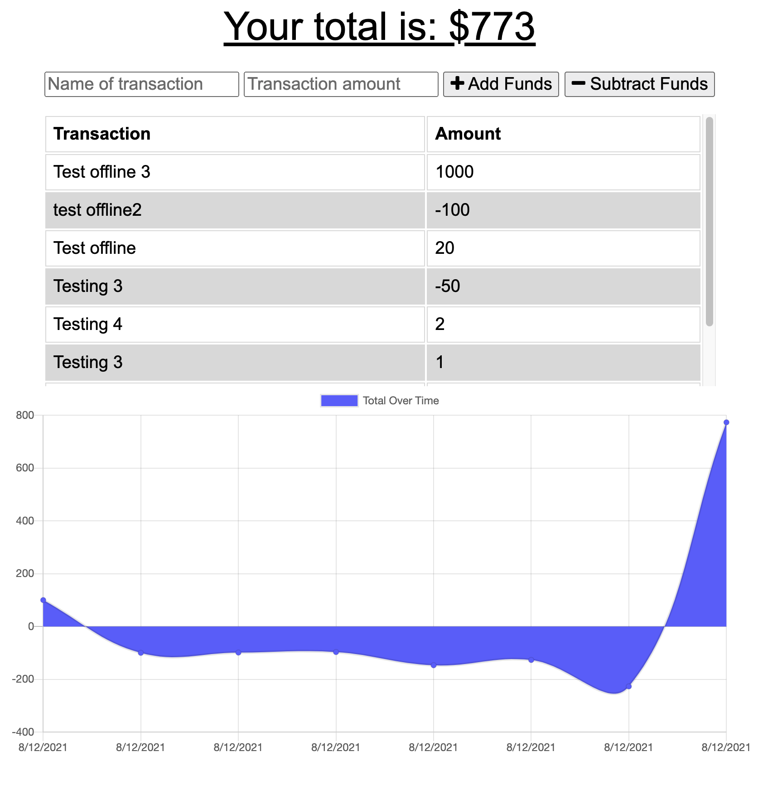

# 19-pwa-progressive-budget

## License

This program adds functionality to an existing Budget Tracker application to allow for offline access and functionality.

The user will be able to add expenses and deposits to their budget with or without a connection. When entering transactions offline, they should populate the total when brought back online.

Offline Functionality:

  * Enter deposits offline

  * Enter expenses offline

When brought back online:

  * Offline entries should be added to tracker.

- - -

## Requirment
GIVEN a user is on Budget App without an internet connection
WHEN the user inputs a withdrawal or deposit
THEN that will be shown on the page, and added to their transaction history when their connection is back online.

- - -
## Mock-up
Application's appearance and functionality:

- - -

## Links to the deployed application

  * Heroku URL: https://sheltered-cliffs-60025.herokuapp.com/Add domain
  
  * Github repository: https://github.com/Tewol/19-pwa-progressive-budget
  
- - -

© 2021 Hewan Redie